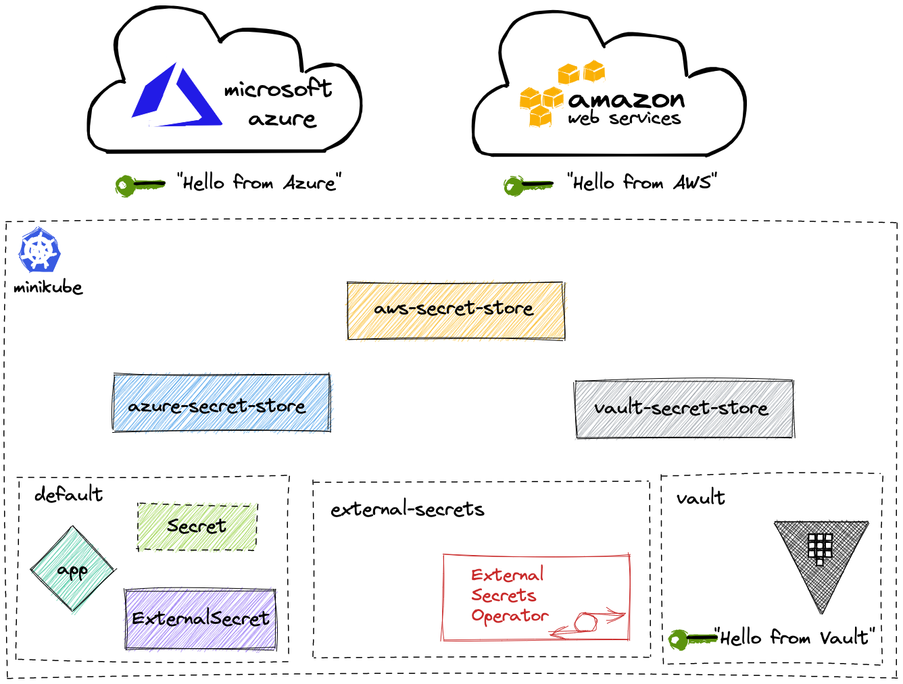

# eso-demo
Demo for the [External Secrets Operator](https://external-secrets.io) at github.com/sebagomez/eso-demo


## Introduction

This repo holds the needed yaml to perform a demo on ESO. These are the features that are easily demoed with this repo.
- Get the value of a secret from an external provider
- Get the metadata of a secret from an external provider
- Push a `Secret` from the cluster to an external provider.

Every suppoerted provider (in this repo) has its corresponding terraform files to spin up the infrastructure. The infrastructure means the secrets themselves, and the infra to access them, IAM user for AWS, App and Service Principal for Azure, Role and ServiceAccount for Kubernetes an so on.

To execute this demo in your own environment keep in mind I assume you already have a few prerequisites in place.
- An accesible cluster and kubectl configure to work with it. In my case I'm using minikube.
- An AWS account and the aws cli configured (if you want to test AWS Secret Manager or AWS Parameter Store)
- An Azure account and the az cli configured (if you want to test Azure Key Vault)
- In this demo I'm also using a local instance of HashiCorp Vault, so you might want to have Helm installed if you want to follow along.

> If you still don't have access to any external provider or a local instance or Vault, you can still play around with the Kubernetes provider.

## How does it work?

With this repo (and the prerequisites) I'll have access to a Kubernetes cluster with the External Secrets Operator installed and I will create a few `ClusterSecretStore` to access the different providers. I'll also create the infrastructure (as mentioned before) in the providers and a few secrets in each of them. For the purpose of the demo, I'm creating thre secrets with the same name in all different providers. These secrets are called `secret-one`, `secret-two` and `three`, and the also share the same tags (`dev`, `example`, and `provider`).

### Why ?

Because I want to show that without modifying the `ExternalSecret` definition I can use different provider to get the secrets.



## Set up

Like I said, I'm using a local [minikube](https://minikube.sigs.k8s.io/docs/start/) cluster but obviously any K8s cluster works. I'm also using Helm to install the External Secret Operator and Vault for local testings.

I took the instructions from the ESO site, but as the moment of this writing it was as easy as adding the repo 

```bash
helm repo add external-secrets https://charts.external-secrets.io && helm repo update
```

and install the ESO Helm chart

```bash
helm install external-secrets external-secrets/external-secrets --create-namespace --namespace external-secrets
```

and that's it!, ESO is not up & running

I'm also using Terraform to create some secrets (and the infrastructure) in the different providers. If you want to do the same make sure you have [Terraform installed](https://developer.hashicorp.com/terraform/tutorials/aws-get-started/install-cli) in your machine.

## Accessing the provider

In this example I'll use [AWS Secrets Manager](https://docs.aws.amazon.com/secretsmanager/latest/userguide/intro.html), [AWS Secret STore](https://docs.aws.amazon.com/systems-manager/latest/userguide/systems-manager-parameter-store.html), [Azure Key Vault](https://azure.microsoft.com/en-us/products/key-vault/), a local (dev) installation of [Hashicorp Vault](https://www.hashicorp.com/products/vault), and also the [Kubernetes provider](https://external-secrets.io/v0.8.1/provider/kubernetes/).


### Hashicorp Vault

If you're going to install Hashicorp Vault in your local cluster like I did, you need to do it in two steps. First, `cd` into the [terraform/vault](./terraform/vault/) folder and execute `terraform apply`. After that is than you will have to espose Vault to create the secrets with Terraform. 
```bash
kubectl port-forward svc/vault -n vault 8200:8200
```
Now can now `cd` into the [secrets](./terraform/vault/secrets/) folder (in another terminal window) and run `terraform apply` from there. This second apply is the one that creates the secret.

There's a tiny script called [tf.sh](./terraform/vault/tf.sh) that will of of the above from you if you prefer. Make sure you set the right parameter.

```bash
./tf.sh [apply|destroy]
```

After everything is created, you can now create you `ClusterSecretStore` for Hashicorp Vault.

```bash
kubectl apply -f ClusterSecretStores/hashicorp-vault/vault-secretstore.yaml
```

### AWS

To create a few secrets and the IAM user to access them in AWS Secrets Manager and AWS Parameter Store you can `terraform apply` from [terraform/aws](./terraform/aws/). The following script would do everything for you.

> It assumes the [aws cli](https://aws.amazon.com/cli/) tool is properly installed and configured

```bash
cd terraform/aws || return 1
terraform init && terraform apply
export AWS_KEY=$(cat ./terraform.tfstate | jq '.resources[1].instances[0].attributes.id' --raw-output)
export AWS_SECRET=$(cat ./terraform.tfstate | jq '.resources[1].instances[0].attributes.secret' --raw-output)
# Create the Secret with AWS credentials
kubectl create secret generic aws-credentials --namespace cred --from-literal=access-key=$AWS_KEY --from-literal=secret=$AWS_SECRET
export AWS_REGION=$(aws configure get region)
# Create the ClusterSecretStore for AWS Secret Manager
eval "echo \"$(cat ../../ClusterSecretStores/aws/awssm_secretstore.template.yaml)\"" | kubectl apply -f -
# And/Or create the ClusterSecretStore for AWS Parameter Store
eval "echo \"$(cat ../../ClusterSecretStores/aws/awsps_secretstore.template.yaml)\"" | kubectl apply -f -
```

### Azure Key Vault

To create a few secrets and the user to access them in Azure Key Vault you can `terraform apply` from [terraform/azure](./terraform/azure/).

> It assumes the [az cli](https://learn.microsoft.com/en-us/cli/azure/install-azure-cli) tool is properly installed and configured

```bash
cd terraform/azure || return 1
terraform init && terraform apply
export APP_ID=$(cat ./terraform.tfstate | jq '.resources | .[] | select(.type=="azuread_application") | .instances[0].attributes.application_id' --raw-output)
export APP_PASSWORD=$(cat ./terraform.tfstate | jq '.resources | .[] | select(.type=="azuread_application_password") | .instances[0].attributes.value' --raw-output)
# Generate the Secret with credentials
kubectl create secret generic azure-credentials --namespace cred --from-literal=clientid=$APP_ID --from-literal=clientsecret=$APP_PASSWORD

export VAULT_URL=$(cat ./terraform.tfstate | jq '.resources | .[] | select(.type=="azurerm_key_vault") | .instances[0].attributes.vault_uri' --raw-output)
export TENANT_ID=$(cat ./terraform.tfstate | jq '.resources | .[] | select(.type=="azurerm_client_config") | .instances[0].attributes.tenant_id' --raw-output)
# Generate the ClusterSecretStore
eval "echo \"$(cat ../../ClusterSecretStores/azure-key-vault/azure_secretstore.template.yaml)\"" | kubectl apply -f -
```

### Kubernetes

I'm also using Terraform to deploy the Roles, RoleBinding and ServiceAccount needed to use the Kubernetes provider. In this example I'm creating a namespace called `remote-cluster` from which I want to sync some csecrets to my eso-demo namespace. In this example the remotes namespace acts as another cluster.

So again, follow this steps to apply the infra and create the ClusterSecretStore for Kubernetes.

```bash
cd terraform/k8s || return 1
terraform init && terraform apply
export CLUSTER_IP=$(minikube ip)
eval "echo \"$(cat ../../ClusterSecretStores/kubernetes/k8s-secretstore.template.yaml)\"" | kubectl apply -f -
```

## Demo 1

For the first demo I'm going to apply all the ExternalSecrets I have in the [ExternalSecrets](./ExternalSecrets/) folder and I'll use the azure provider. That means that every `ExternalSecret` will have the `azure-secret-store` `ClusterSecretStore` as the `secretStoreRef`.

To simply the application and edition of the files, there's a tiny script at the root of this repo called [apply.sh](./apply.sh) that will 'kubectl apply' every ExternalSecret with the provider sent by parameter. 

So, in my case
```bash 
./apply.sh azure
```
We can now seee that every ExternalSecret has been applied and their status is SecretSynced
```bash
❯ k get externalsecret
NAME                     STORE                REFRESH INTERVAL   STATUS         READY
data-by-name             azure-secret-store   15s                SecretSynced   True
data-fetch-tags          azure-secret-store   15s                SecretSynced   True
datafrom-fetch-tags      azure-secret-store   15s                SecretSynced   True
datafrom-find-by-regex   azure-secret-store   15s                SecretSynced   True
datafrom-find-by-tags    azure-secret-store   15s                SecretSynced   True
```

So, what does `SecretSynced` mean? It means that ESO synced that ExternalSecret and created a `Secret` in my namespace.

```bash
❯ k get secret                 
NAME                     TYPE     DATA   AGE
data-by-name             Opaque   1      51m
data-fetch-tags          Opaque   1      51m
datafrom-fetch-tags      Opaque   3      49m
datafrom-find-by-regex   Opaque   2      51m
datafrom-find-by-tags    Opaque   2      51m
```

Let's take a look at one of them (data-by-name)
```bash
❯ k get secret data-by-name -ojsonpath='{.data.secret-value}' | base64 -d
Hello from Azure Key Vault%    
```

## Demo 2

Let's now change the provider for that `ExternalSecret` (data-by-name)
```bash
k edit ExternalSecret data-by-name
```
and let's see the content again
```bash
❯ k get secret data-by-name -ojsonpath='{.data.secret-value}' | base64 -d
Hello from AWS Secret Manager%   
```

Feel free to play around and change the name of the `ClusterSecretStore` for the different `ExternalSecrets`. Keep in mind the valis values are
```bash
❯ k get clustersecretstore
NAME                 AGE   STATUS   CAPABILITIES   READY
awsps-secret-store   23m   Valid    ReadWrite      True
awssm-secret-store   23m   Valid    ReadWrite      True
azure-secret-store   16m   Valid    ReadWrite      True
k8s-secret-store     13m   Valid    ReadOnly       True
vault-secret-store   87m   Valid    ReadWrite      True
```

## Demo 3

This is something new in the ESO. We now have the poribility to PUSH a secret to an external provider. 
In order to do that we're going to apply a new `Secret` that I want to push, and a `PushSecret` that will push it... take a look at [this file](./PushSecrets/data-by-name.yaml)

```bash 
❯ k apply -f ./PushSecrets/data-by-name.yaml 
pushsecret.external-secrets.io/data-by-name created
secret/my-own-secret created
```

We now have a new `Secret` called _my-own-secret_, that one was created by us, and there's a `PushSecret` that's configured to PUSH that `Secret` using the _vault-secret-store_ `ClusterSecretStore`.

So if you now go in your browser (or your Vault cli tool) to your Vault, you'll find a new secret called _my-pushed-scret_ with the value from the _my-own-secret_ `Secret`

## Demo 4

We can also use an `ExternalSecret` to create a `Secret` from a generated secret from different Generators. Generators can be Azure Container Registry (ACRAccessToken), AWS Elastic Container Registry (ECRAuthorizationToken), Google Container Registry (GCRAccessToken), Vault Dynamic Secret (VaultDynamicSecret), Password and Fake. 

For this demo we'll generate a `Password` and a `Fake`

```bash
❯ k apply -f Generators/ 
fake.generators.external-secrets.io/fake-key created
externalsecret.external-secrets.io/fake created
password.generators.external-secrets.io/my-password created
externalsecret.external-secrets.io/my-password created
```

We now have two `Secret` _fake_ and _my-password_. 
```bash
❯ k get secret
NAME          TYPE     DATA   AGE
fake          Opaque   2      22s
my-password   Opaque   1      22s
```

_fake_ has the same keys defined in the `Fake`, while _my-password_ has a single key called password with a random generated password based on the spec.

## Clean up

- Delete all the `ExternalSecrets` 
```bash
❯ k delete -f ExternalSecrets
externalsecret.external-secrets.io "data-by-name" deleted
externalsecret.external-secrets.io "data-fetch-tags" deleted
externalsecret.external-secrets.io "datafrom-fetch-tags" deleted
externalsecret.external-secrets.io "datafrom-find-by-regex" deleted
externalsecret.external-secrets.io "datafrom-find-by-tags" deleted
```

- Delete the `PushSecret`
```bash
❯ k delete -f PushSecrets/
pushsecret.external-secrets.io "data-by-name" deleted
secret "my-own-secret" deleted
```

- Delete the `ClusterSecretStore`
```bash
❯ k delete clustersecretstore --all
clustersecretstore.external-secrets.io "awsps-secret-store" deleted
clustersecretstore.external-secrets.io "awssm-secret-store" deleted
clustersecretstore.external-secrets.io "azure-secret-store" deleted
clustersecretstore.external-secrets.io "k8s-secret-store" deleted
clustersecretstore.external-secrets.io "vault-secret-store" deleted
```

- Delete the generators
```bash
❯ k delete -f Generators/
fake.generators.external-secrets.io "fake-key" deleted
externalsecret.external-secrets.io "fake" deleted
password.generators.external-secrets.io "my-password" deleted
externalsecret.external-secrets.io "my-password" deleted
```

- Terraform destroy every provider you spung up

- Delete the _eso-demo_, _cred_ and _remote-cluster_ namespaces.
```bash
❯ k delete ns remote-cluster eso-demo cred
namespace "remote-cluster" deleted
namespace "eso-demo" deleted
namespace "cred" deleted
```

Let me know if you have comments and/or feedback. 
PRs are always welcome


> This repo, and all its content and demos are "works on my machine" certified 👍

